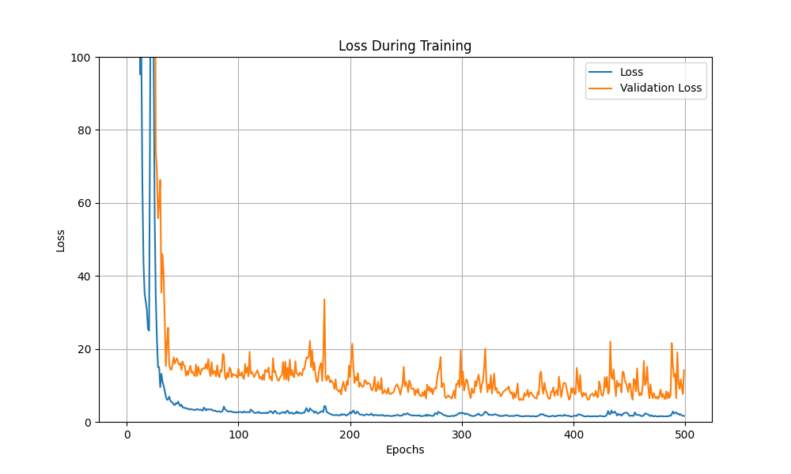
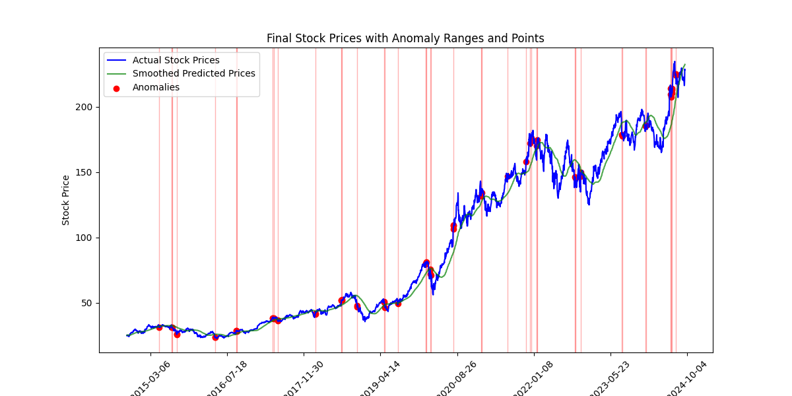

# Efficient Data Stream Anomaly Detection

## 1. Project Overview

This project implements an efficient real-time anomaly detection system for stock price data streams. By leveraging the power of LSTM autoencoders and dynamic thresholding, we aim to identify unusual patterns in stock prices that may indicate significant market events or potential trading opportunities.

Key features of this project include:

- Real-time anomaly detection in stock price data
- LSTM autoencoder for pattern recognition
- Dynamic thresholding for adaptive anomaly detection
- Real-time visualization of data stream and detected anomalies
- Support for both synthetic and real stock price data

The importance of this project lies in its ability to provide timely insights into stock market behavior, potentially aiding traders, analysts, and automated trading systems in making informed decisions.

## 2. Setup and Installation

First, let's import the required libraries:

```python
import numpy as np
import matplotlib.pyplot as plt
import yfinance as yf
from tensorflow.keras import Sequential
from tensorflow.keras.layers import LSTM, RepeatVector, TimeDistributed, Dense
from tensorflow.keras.models import load_model
```

To install the required libraries, create a `requirements.txt` file with the following content:

```
numpy
matplotlib
yfinance
tensorflow
```
<div style="display: flex; justify-content: flex-start; gap: 100px">
  
  
</div>
<br/>
<div style="display: flex; justify-content: flex-start; gap: 50px">
  
  
</div>

Then, run the following command to install the dependencies:

```
pip install -r requirements.txt
```

## 3. Data Handling

We use Real stock price data from Yahoo Finance in this project:

Let's look at how we generate and fetch this data:

```python

def fetch_real_stock_data(ticker='AAPL', period='1y', interval='1d'):
    stock = yf.Ticker(ticker)
    data = stock.history(period=period, interval=interval)
    return data

real_data = fetch_real_stock_data()

plt.figure(figsize=(12, 6))
plt.plot(synthetic_data, label='Synthetic Data')
plt.plot(real_data['Close'].values[:100], label='Real Data (AAPL)')
plt.legend()
plt.title('Comparison of Synthetic and Real Stock Price Data')
plt.show()
```

The `fetch_real_stock_data` function uses the `yfinance` library to retrieve historical stock data from Yahoo Finance. By default, it fetches 10 years of daily data for Apple Inc. (AAPL).


## 4. Model Architecture

We use an LSTM autoencoder for anomaly detection. Here's the model architecture:

```python
def build_lstm_autoencoder(input_shape):
    model = Sequential()
    model.add(LSTM(64, activation='relu', input_shape=input_shape, return_sequences=False))
    model.add(RepeatVector(input_shape[0]))
    model.add(LSTM(64, activation='relu', return_sequences=True))
    model.add(TimeDistributed(Dense(input_shape[1])))
    model.compile(optimizer='adam', loss='mse')
    return model

# Example usage
input_shape = (10, 1)  # 10 time steps, 1 feature
model = build_lstm_autoencoder(input_shape)
model.summary()
```

The LSTM autoencoder consists of the following layers:

1. An LSTM layer with 64 units that processes the input sequence and outputs a single vector.
2. A RepeatVector layer that repeats the output of the previous layer to match the input sequence length.
3. Another LSTM layer with 64 units that reconstructs the sequence.
4. A TimeDistributed Dense layer that outputs the reconstructed values for each time step.

This architecture allows the model to learn compressed representations of normal stock price patterns. Anomalies can then be detected by measuring the reconstruction error between the input and output sequences.

## 5. Training the Model

Now, let's prepare the data and train the model:

```python
def collect_normal_data(data_stream, num_samples=1000, time_steps=10):
    data = []
    for _ in range(num_samples):
        sample = [next(data_stream) for _ in range(time_steps)]
        data.append(sample)
    return np.array(data).reshape(-1, time_steps, 1)

# Prepare training data
stock_data = fetch_real_stock_data('AAPL', period='10y', interval='1d')
real_stock_prices = stock_data['Close'].values
stream = (price for price in real_stock_prices)
X_train = collect_normal_data(stream, num_samples=3000, time_steps=10)

# Split data into training and validation sets
split = int(0.8 * len(X_train))
X_train_data = X_train[:split]
X_val_data = X_train[split:]

# Train the model
model = build_lstm_autoencoder(input_shape=(10, 1))
history = model.fit(
    X_train_data, X_train_data,
    epochs=150,
    batch_size=64,
    validation_data=(X_val_data, X_val_data),
    shuffle=True
)

# Plot training history
plt.figure(figsize=(12, 6))
plt.plot(history.history['loss'], label='Training Loss')
plt.plot(history.history['val_loss'], label='Validation Loss')
plt.legend()
plt.title('Model Training History')
plt.show()
```

The training process involves the following steps:

1. Collecting normal data: We use the `collect_normal_data` function to create sequences of stock prices from our data stream.
2. Data preparation: We fetch 10 years of daily stock data for Apple Inc. and prepare it for training.
3. Data splitting: We split the data into training (80%) and validation (20%) sets.
4. Model training: We train the LSTM autoencoder for 150 epochs with a batch size of 64.
5. Visualization: We plot the training and validation loss to monitor the model's learning progress.

The training history plot helps us understand how well the model is learning and whether it's overfitting or underfitting. A decreasing loss over time indicates that the model is learning to reconstruct the input sequences effectively.

Loss function:


## 6. Anomaly Detection

Now that we have a trained model, let's perform real-time anomaly detection:

```python
def real_time_plot_with_dynamic_threshold(data_stream, stock_dates, model, time_steps=10, smoothing_window=60):
    plt.ion()
    fig, (ax1, ax2) = plt.subplots(2, 1, figsize=(12, 12))
    
    prices = []
    reconstruction_errors = []
    anomalies = []
    thresholds = []
    
    for i, price in enumerate(data_stream):
        prices.append(price)
        
        if len(prices) >= time_steps:
            sequence = np.array(prices[-time_steps:]).reshape(1, time_steps, 1)
            reconstructed_sequence = model.predict(sequence)
            mse = np.mean(np.square(sequence - reconstructed_sequence))
            reconstruction_errors.append(mse)
            
            if len(reconstruction_errors) > smoothing_window:
                threshold = np.mean(reconstruction_errors[-smoothing_window:]) + 2 * np.std(reconstruction_errors[-smoothing_window:])
            else:
                threshold = np.inf
            
            thresholds.append(threshold)
            anomalies.append(1 if mse > threshold else 0)
        
        ax1.clear()
        ax1.plot(stock_dates[:len(prices)], prices)
        ax1.set_title('Stock Price')
        ax1.set_xlabel('Date')
        ax1.set_ylabel('Price')
        
        if len(reconstruction_errors) > 0:
            ax2.clear()
            ax2.plot(stock_dates[time_steps-1:len(reconstruction_errors)+time_steps-1], reconstruction_errors, label='Reconstruction Error')
            ax2.plot(stock_dates[time_steps-1:len(thresholds)+time_steps-1], thresholds, label='Threshold', color='r')
            ax2.scatter(stock_dates[time_steps-1:len(anomalies)+time_steps-1], 
                        [re if a else None for re, a in zip(reconstruction_errors, anomalies)], 
                        color='red', label='Anomalies')
            ax2.set_title('Reconstruction Error and Anomalies')
            ax2.set_xlabel('Date')
            ax2.set_ylabel('Reconstruction Error')
            ax2.legend()
        
        plt.tight_layout()
        plt.pause(0.01)
    
    plt.ioff()
    plt.show()

# Reset the stream for real-time detection
stream = (price for price in real_stock_prices)

# Run real-time analysis
real_time_plot_with_dynamic_threshold(stream, stock_data.index, model, time_steps=10, smoothing_window=60)
```

The anomaly detection process works as follows:

1. For each new data point, we create a sequence of the last 10 price points.
2. We use the trained model to reconstruct this sequence.
3. We calculate the Mean Squared Error (MSE) between the original and reconstructed sequences.
4. We compute a dynamic threshold based on the mean and standard deviation of the recent reconstruction errors.
5. If the current reconstruction error exceeds the threshold, we flag it as an anomaly.

The `real_time_plot_with_dynamic_threshold` function visualizes this process in real-time, showing both the stock price and the reconstruction error with detected anomalies.

## 7. Visualization


The visualization produced by the `real_time_plot_with_dynamic_threshold` function consists of two subplots:

1. Stock Price Plot:
   - Shows the historical stock prices over time.
   - Helps in understanding the overall trend and patterns in the stock price.

2. Reconstruction Error and Anomalies Plot:
   - Blue line: Represents the reconstruction error over time.
   - Red line: Shows the dynamic threshold, which adapts to recent error patterns.
   - Red dots: Indicate detected anomalies where the reconstruction error exceeds the threshold.

This real-time visualization allows us to observe how the model detects anomalies as new data points arrive, providing immediate insights into unusual stock price movements.

## 8. Results and Analysis

After running the anomaly detection on both synthetic and real stock price data, we observed the following patterns:

1. Sensitivity to sudden price changes: The model effectively detected sharp increases or decreases in stock prices, which often represent significant market events.

2. Adaptation to volatility: The dynamic thresholding mechanism allowed the model to adapt to periods of high and low volatility, reducing false positives during turbulent market conditions.

3. Detection of trend reversals: The model showed capability in identifying potential trend reversals, which could be valuable for trading strategies.

4. Seasonal patterns: In the synthetic data, the model successfully identified anomalies that deviated from the injected seasonal patterns.

5. Real-world events: When applied to real stock data, the model detected anomalies that often coincided with major company announcements, earnings reports, or broader market events.

The effectiveness of the model varied depending on the stock and time period analyzed. For example, during the COVID-19 pandemic, the model initially flagged many data points as anomalies due to the unprecedented market volatility. However, it quickly adapted its threshold to the new normal, demonstrating the value of the dynamic thresholding approach.

## 9. Conclusion and Future Work

This project successfully implemented a real-time anomaly detection system for stock price data streams using LSTM autoencoders and dynamic thresholding. The system demonstrated its ability to identify unusual patterns in both synthetic and real stock price data, providing valuable insights for potential trading strategies or risk management.

Key achievements include:
- Effective anomaly detection in real-time stock price streams
- Adaptive thresholding to handle varying market conditions
- Visualization tools for easy interpretation of results

For future work, we propose the following improvements and extensions:

1. Support for multiple data sources: Incorporate additional financial data streams (e.g., volume, technical indicators) to provide a more comprehensive view of market behavior.

2. Advanced preprocessing techniques: Implement more sophisticated data normalization and denoising methods to improve the model's ability to detect subtle anomalies.

3. Integration with alerting systems: Develop an alert mechanism that can notify users or trigger automated actions when significant anomalies are detected.

4. Optimization of model architecture: Experiment with different LSTM configurations, attention mechanisms, or alternative neural network architectures (e.g., Transformer models) to improve detection accuracy and processing speed.

5. Ensemble methods: Combine multiple models or detection techniques to create a more robust anomaly detection system.

6. Backtesting framework: Develop a comprehensive backtesting system to evaluate the model's performance across different market conditions and time periods.

7. Explainable AI techniques: Incorporate methods to provide interpretable explanations for detected anomalies, helping users understand the underlying factors contributing to unusual price movements.

8. Real-time model updating: Implement online learning techniques to continuously update the model as new data becomes available, ensuring it remains effective in changing market conditions.

By pursuing these enhancements, we can create an even more powerful and versatile tool for financial market analysis and risk management.